### Project Introduction

SSM based food delivery ordering mini program (Uniapp implementation): front-end Uniapp, Vue, ElementUI, back-end SpringBoot, Mybatis. The system roles are divided into administrator, merchant, and user. The administrator manages the store in the management background, publishes announcements, adds new administrators, and performs corresponding data statistics; Merchants release products, etc; Users shop based on the published products, etc.

### Startup method

- Front end webStorm
> cd vue
>
> npm install
>
> npm run serve
>
- Mini program HBuilderX

> 
> Button Start | Enter HBuilderX ->Run ->Run to Browser ->Chrome Or Edge

- Backend idea
> Button Start | Right click to run SpringbootApplication

---

### administrators:

- Basic operations: login, modify personal information, upload pictures, obtain personal information, change passwords, sales statistics, order statistics, price statistics, current discount rate statistics, merchant transaction distribution
- Product classification information management: obtain product classification list, filter product classification information, add product classification information, delete product classification information, edit product classification information
- Product information management: obtain product list, filter product information, add product information, delete product information, edit product information, remove and list products
- Order management: retrieve order list, filter order information, delete order information, edit order information, view order details
- Store collection information management: obtain store collection list, filter store collection information, delete store collection information
- Store comment management: Get a list of store comments, filter store comment information, delete store comments, store ratings
- Advertising management: obtaining ad lists, filtering ad information, deleting ad information, publishing ads, modifying ad content
- Announcement management: obtain announcement list, filter announcement information, delete announcement information, publish announcements, modify announcement content
- Announcement management: obtain announcement list, filter announcement information, delete announcement information, publish announcements, modify announcement content
- User management: obtain administrator list, filter administrator information, modify administrator information, delete administrator information, add administrator, obtain merchant list, filter merchant information, modify merchant information, delete merchant information, add merchant, obtain user list, filter user information, modify user information, delete user information, add user

---

### Merchant:

- Basic operations: login, modify personal information, upload pictures, obtain personal information, change password, upload business license, sales statistics, order statistics, price statistics, current discount rate statistics
- Product classification information management: obtain product classification list, filter product classification information, add product classification information, delete product classification information, edit product classification information
- Product information management: obtain product list, filter product information, add product information, delete product information, edit product information, remove and list products
- Order management: retrieve order list, filter order information, view order details
- Store collection information management: obtain store collection list, filter store collection information, delete store collection information
- Store comment management: Get a list of store comments, filter store comment information, delete store comments

---

### User:

- Basic operations: login, register, modify personal information, upload pictures, obtain personal information
- Merchant management: Get a list of popular merchants, filter popular merchant information, view reviews, and bookmark merchants
- Product management: Get product list, filter product information, add to shopping cart
- Order management: obtain order list, delete orders, confirm receipt, evaluate orders, place orders, make payments, and issue refunds
- Personal Center: Get shipping list, add shipping address, get favorites list, view favorite merchants, cancel favorites, favorite merchants, get review list, get browsing history, about us, user agreement

---

## environment

- <b>IntelliJ IDEA 2024.3</b>

- <b>HBuilderX 3.7.9.20230324及以上</b>

- <b>Mysql 5.7.26</b>
  
- <b>NodeJs 14.17.3</b>

- <b>Maven 3.6.3</b>

- <b>JDK 1.8</b>

---

### User side running screenshot
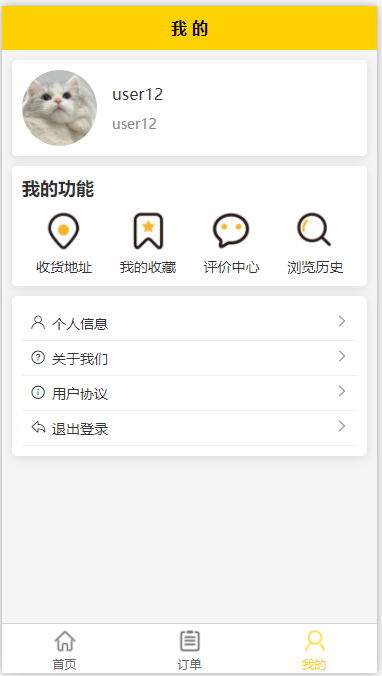
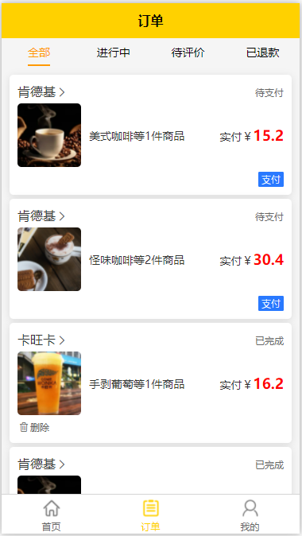
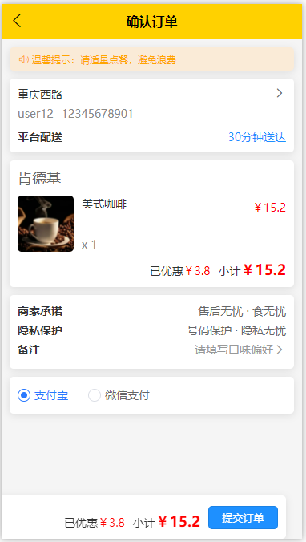
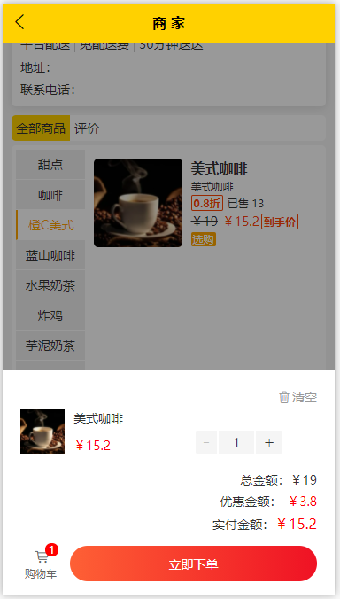
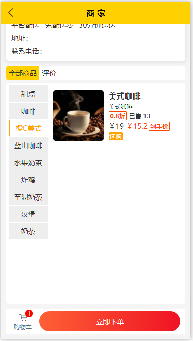
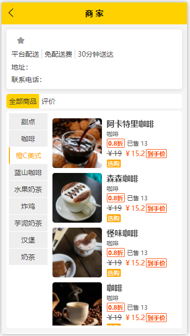
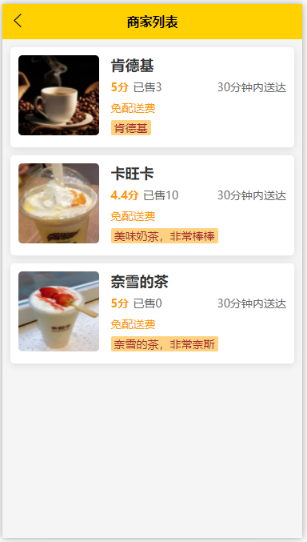
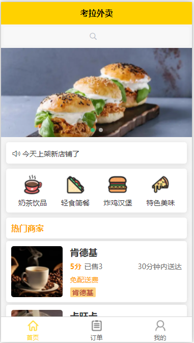

---

### Screenshot of administrator side operation
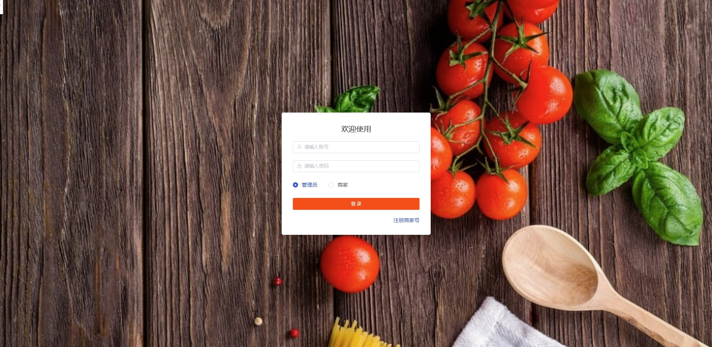
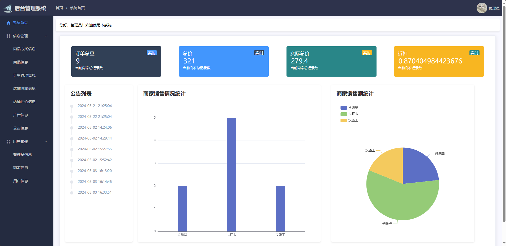
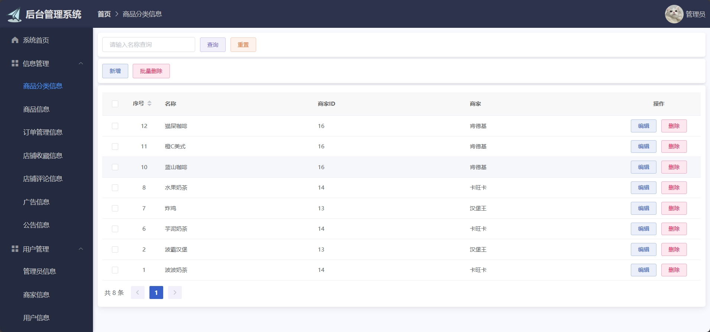
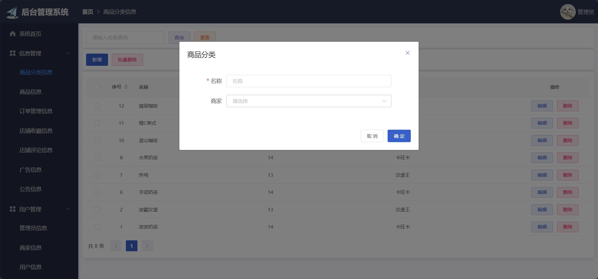
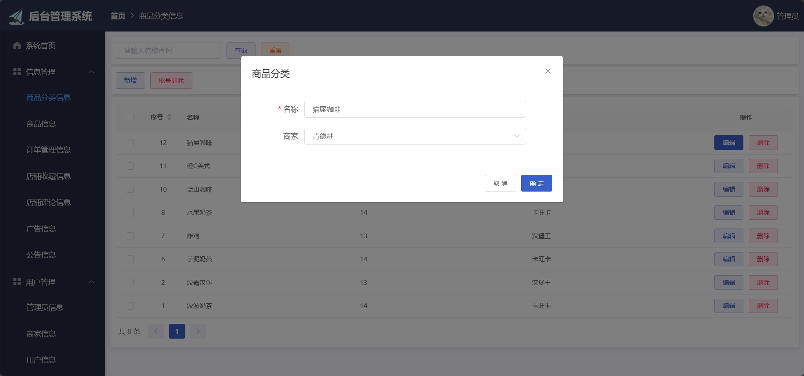
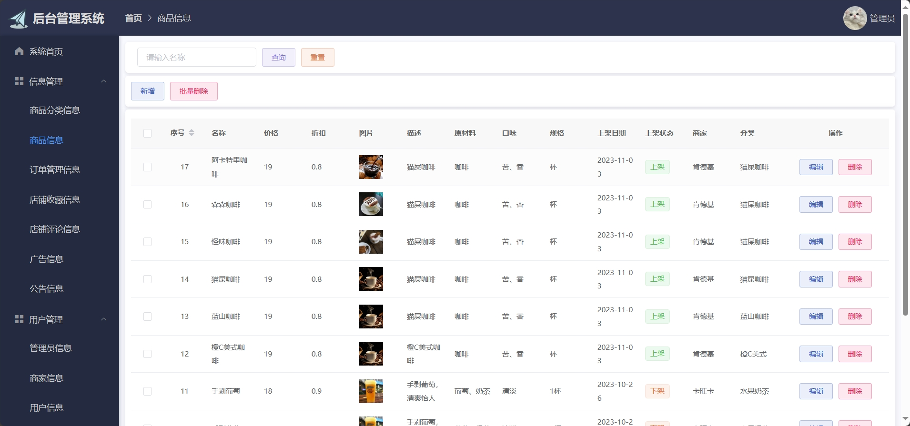
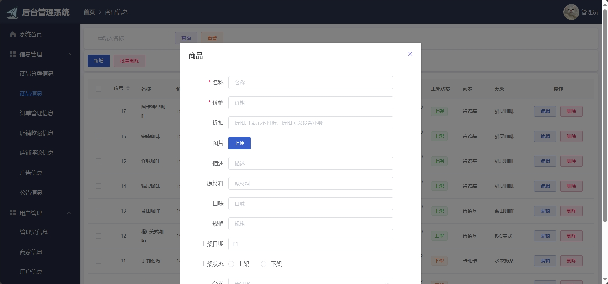
